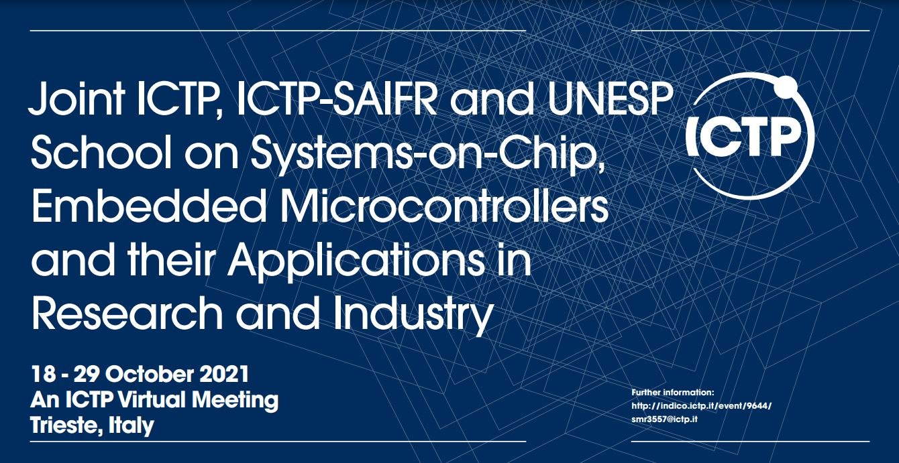

# Joint ICTP, SAIFR and UNESP School on Systems-on-Chip, Embedded Microcontrollers and their Applications in Research and Industry | (smr 3557)

## An ICTP Virtual Meeting

The School will focus on the development of scientific instrumentation based on fully programmable Systems-on-Chip (SoC) and embedded microcontrollers. The aim is to provide appropriate methodological practices and key know-how to effectively take advantage of this technology for applications in research and industry.

Participants will be familiarized with professional software design tools and hardware platforms through theoretical lectures, demonstrations, tutorials and practical exercises, and will apply the acquired knowledge in projects. In addition, they will be introduced to an open-source SoC-FPGA firmware platform, providing a well-tested interface with the control computer.

Link to [event](http://indico.ictp.it/event/9644/).

## Laboratories Guides

### Week 1

[STM32F411 Docs](https://gitlab.com/smr3557/labs/-/wikis/NUCLEO-F411RE-Documents) <-- IMPORTANT!

[Lab 1: Blink Internal LED](https://gitlab.com/smr3557/labs/-/wikis/Blink-Internal-Led)

[Lab 2: Blink External LEDs](https://gitlab.com/smr3557/labs/-/wikis/Blink-External-LEDs)

[Lab 3: Blink External LED with Timer](https://gitlab.com/smr3557/labs/-/wikis/Timer/Blink-external-LED-with-Timer)

[Lab 4: Modulate LED brightness with PWM](https://gitlab.com/smr3557/labs/-/wikis/Modulate-LED-brightness-with-PWM)

[Lab 5: Three phase LED brightness modulation with PWM](https://gitlab.com/smr3557/labs/-/wikis/Three-phase-LED-brightness-modulation-with-PWM)

[Lab 6: Simple Hello World via UART](https://gitlab.com/smr3557/labs/-/wikis/Simple-Hello-World-via-UART)

[Lab 7: Hello World via UART with printf redirect](https://gitlab.com/smr3557/labs/-/wikis/Hello-World-via-UART-with-printf-redirect)

[Lab 8: Hello World via UART with interrupt](https://gitlab.com/smr3557/labs/-/wikis/Hello-World-via-UART-with-interrupt)

[Lab 9: Hello World via UART with DMA](https://gitlab.com/smr3557/labs/-/wikis/Hello-World-via-UART-with-DMA)

[Lab 10: UART loopback](https://gitlab.com/smr3557/labs/-/wikis/UART-loopback)

[Lab 11: Blink Internal LED with FreeRTOS](https://gitlab.com/smr3557/labs/-/wikis/Blink-Internal-LED-with-FreeRTOS)

[Lab 12: Hello World with FreeRTOS](https://gitlab.com/smr3557/labs/-/wikis/Hello-World-with-FreeRTOS)

[Lab 13: Hello World with two FreeRTOS tasks](https://gitlab.com/smr3557/labs/-/wikis/Hello-World-with-two-FreeRTOS-tasks)

[Lab 14: FreeRTOS semaphore](https://gitlab.com/smr3557/labs/-/wikis/FreeRTOS-semaphore)

[Lab 15: Reading out a BMP280 pressure sensor](https://gitlab.com/smr3557/labs/-/wikis/Lab-15:-Reading-out-a-BMP280-pressure-sensor)

[Lab 16: Reading out a MPU6050 gyroscopic sensor](https://gitlab.com/smr3557/labs/-/wikis/Lab-16:-Reading-out-a-MPU6050-gyroscopic-sensor)

### Week 2 

[Lab 1: Vivado-Design Flow for a Simple PS Design](https://gitlab.com/smr3557/labs/-/wikis/Lab-1:-Vivado-Design-Flow-for-a-Simple-PS-Design)

[Lab 2: GPIO](https://gitlab.com/smr3557/labs/-/wikis/Lab-2:-GPIO-IP-Cores-%E2%80%93-PS-Rd/Lab-2:-GPIO-IP-Cores-%E2%80%93-PS-Rd&Wr)

[Lab 3: ComBlock](https://gitlab.com/smr3557/labs/-/wikis/Lab-3:-Comblock)

[Lab 4: Universal Direct Memory Access](https://gitlab.com/smr3557/labs/-/wikis/Lab-4:-Universal-Direct-Memory-Access-(UDMA))

[Lab 5: VHDL](https://gitlab.com/smr3557/labs/-/wikis/Lab-5:-VHDL)

[Lab 6: Project Integration](https://gitlab.com/smr3557/labs/-/wikis/PSD)

<!--
[Lab 4: SoC-FPGA Lab exercises with Tutors](https://gitlab.com/smr3557/labs/-/wikis/Lab-5:-Custom-IP)
<!--
* [Lab 4: SoC-FPGA Lab exercises with Tutors](https://gitlab.com/smr3557/labs/-/wikis/Lab-5:-Custom-IP)

* [Lab 5: UDMA](https://gitlab.com/smr3557/labs/-/wikis/Lab-4:-Direct-Memory-Access-(DMA))
-->
